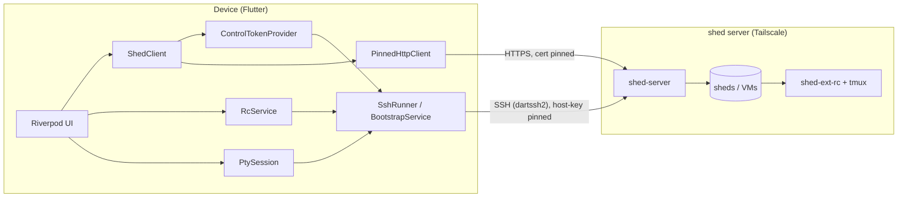

# shed-mobile

A native Flutter fat-client for [shed](https://github.com/charliek/shed) servers.
The device talks **directly** to each shed server over Tailscale — there is no
orchestrator process to run. It is the on-device equivalent of the
`shed-remote-agent` orchestrator, with the same transport logic ported into Dart.

Targets: macOS and Linux desktop, and Android. Private, sideload-only — not for
any app store.

## What it does

- **Browse and manage sheds** on each server: list, start, stop, delete, and
  create (with live SSE progress).
- **Manage remote-control (RC) sessions** inside a shed via the `shed-ext-rc`
  guest binary — create `claude-rc` / `claude-broker` / `shell` sessions, see
  their derived state, and copy/open the `claude.ai` URL.
- **Attach an in-app terminal** to any RC session's tmux pane.

Everything happens on the device: it mints its own control tokens over SSH, pins
each server's self-signed TLS certificate, and pins each server's SSH host key.

## Architecture at a glance

- **SSH (dartssh2)** mints control tokens (`_bootstrap`), drives `shed-ext-rc`,
  and carries the terminal PTY (`tmux attach`).
- **Pinned-TLS HTTPS** calls each shed's control API with the minted bearer token.
- **One per-device ed25519 key** — generated in-app on mobile, or `~/.ssh` on
  desktop — trusted by the server (GitHub `auth.ssh.github_users`, or a local
  `auth.ssh.authorized_keys`).

## Status

| Milestone | Scope | State |
|---|---|---|
| M0 | SSH mint + pinned-TLS transport | Complete |
| M1 | Server management + shed CRUD + create (SSE) | Complete |
| M2 | RC sessions via `shed-ext-rc` | Complete |
| M3 | In-app terminal (xterm ↔ `tmux attach` PTY) | Complete |
| M4 | Android port + in-app keygen + foreground service | Complete (code); on-device validated on the Pixel 8 emulator |
| M5 | Release builds + signing + docs | Complete (macOS notarization is a deployment-time human gate) |

## Where to start

- New here? [Quick Start](getting-started/quick-start.md).
- Want the security model? [Transport & Security](architecture/transport-security.md).
- Picking up the project as an agent? [For AI Agents](development/agents.md).
